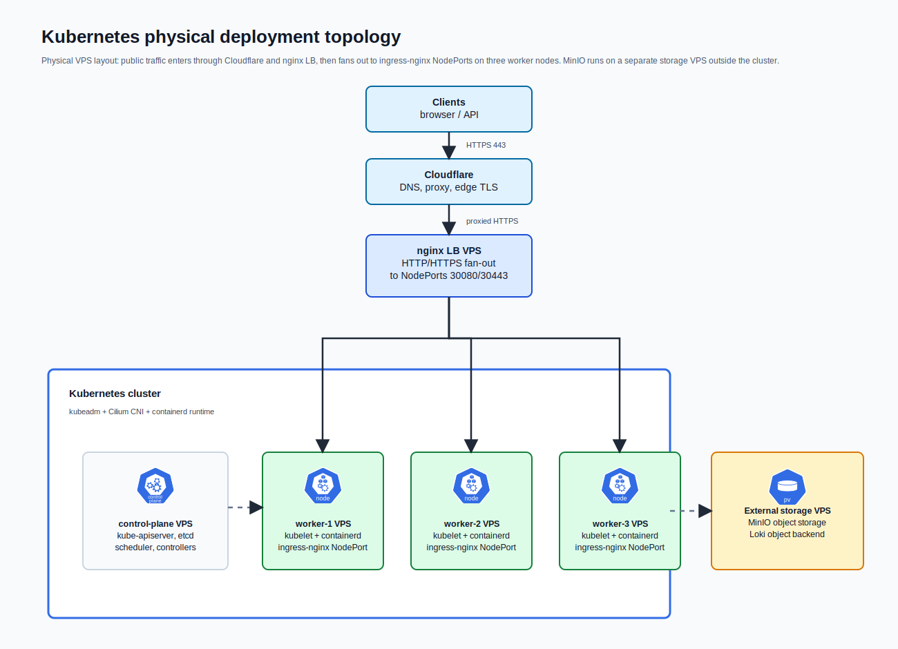

# k8s-cluster-bootstrap

Public version of a Kubernetes bootstrap and operations repository for two VPS-based environments: `dev` and `prod`.

The repository contains the automation used to prepare Linux hosts, create a Kubernetes cluster with `kubeadm`, install the platform layer, and hand the long-running desired state over to Argo CD.



## What Is In This Repository

This repository keeps the operational structure of the original project:

- Ansible inventories for cluster nodes and standalone load balancers
- staged Ansible playbooks for cluster bootstrap, teardown and application operations
- shell entrypoints used from a local Linux/WSL environment
- Kubernetes manifests organized for Argo CD and Kustomize
- monitoring, ingress, cert-manager, Sealed Secrets and application manifests
- GitHub Actions validation for shell scripts, YAML, Kustomize overlays and repository consistency

The following runtime or secret-bearing files are intentionally not included:

- local `.env.bootstrap.local`
- temporary password files
- SOPS source secret files
- kubeconfigs
- bootstrap/setup/teardown logs
- `docs/`

SealedSecret manifests are kept for structure, but encrypted payloads are replaced with `encryptedData: {}`.

## Environments

| Environment | Branch | Cluster inventory | LB inventory | Base domain |
| --- | --- | --- | --- | --- |
| `prod` | `main` | `ansible/inventory/prod/hosts.yml` | `ansible/inventory/lb-prod/hosts.yml` | `klexify.io` |
| `dev` | `dev` | `ansible/inventory/dev/hosts.yml` | `ansible/inventory/lb-dev/hosts.yml` | `dev-klexify.cloud` |

The branch and inventory must match. Bootstrap, teardown and secret-sealing entrypoints enforce this before high-impact operations continue.

## Deployment Topology

The diagram above shows the reusable physical runtime topology for both environments: Cloudflare edge, nginx load balancer VPS, kubeadm Kubernetes cluster, worker NodePorts and external storage VPS.

| Environment | Public edge | Kubernetes nodes | Storage |
| --- | --- |
| `prod` | Cloudflare -> nginx LB `194.164.63.224` | control-plane `85.215.150.64`, workers `85.215.150.65`, `85.215.150.68`, `85.215.150.69` | MinIO on `87.106.147.10` |
| `dev` | Cloudflare -> nginx LB `87.106.21.4` | control-plane `87.106.11.11`, workers `217.154.147.130`, `87.106.146.241`, `194.164.207.175` | MinIO on `87.106.90.193` |

External traffic follows this path:

```text
Cloudflare -> nginx load balancer -> ingress-nginx NodePort -> Kubernetes Service -> Pod
```

GitOps state follows this path:

```text
GitHub repository -> Argo CD -> Kubernetes namespaces and resources
```

The load balancer forwards HTTP/HTTPS traffic to ingress-nginx NodePorts on worker nodes:

```text
TCP 80  -> worker NodePort 30080
TCP 443 -> worker NodePort 30443
```

## Bootstrap Flow

`ansible/site.yml` runs the cluster bootstrap in phases:

1. preflight connectivity and OS checks
2. OS preparation
3. containerd installation
4. Kubernetes package installation
5. firewall configuration
6. MinIO storage preparation
7. kubeadm control-plane initialization
8. worker joins
9. Cilium installation
10. Argo CD installation
11. initial GitOps bootstrap
12. secret sealing
13. infrastructure and monitoring application bootstrap

After the base platform is ready, standalone playbooks deploy or remove the application manifests under `kubernetes/apps/garmin-ingest/`.

## GitOps Layout

```text
kubernetes/
├── system/                     # base cluster components
├── infrastructure/             # ingress, issuers, blackbox probes
└── apps/
    ├── monitoring/             # Prometheus, Grafana, Loki, Promtail, alerts
    └── garmin-ingest/          # API, worker, Redis, CNPG PostgreSQL
```

Argo CD reconciles the system, infrastructure, monitoring and application overlays from Git. Environment-specific differences live under `overlays/dev` and `overlays/prod`.

## Platform Layer

The base platform is split between `kubernetes/system/`, `kubernetes/infrastructure/` and `kubernetes/apps/monitoring/`.

| Component | Source | Responsibility |
| --- | --- | --- |
| Cilium | installed during bootstrap | Kubernetes CNI and pod networking |
| ingress-nginx `4.14.3` | `kubernetes/system/ingress-nginx.yaml` | public cluster entrypoint exposed through worker NodePorts |
| cert-manager `v1.19.4` | `kubernetes/system/cert-manager.yaml` | ACME issuer automation and TLS certificate lifecycle |
| Sealed Secrets | `kubernetes/system/sealed-secrets.yaml` | Git-safe delivery of Kubernetes secrets |
| Argo CD `9.4.4` | `ansible/playbooks/08-install-argocd.yml` | GitOps controller for system, infrastructure, monitoring and app manifests |
| CloudNativePG | `kubernetes/system/cloudnative-pg-operator.yaml` | PostgreSQL operator used by `garmin-ingest` |
| local-path-provisioner | `kubernetes/system/local-path-provisioner.yaml` | default local persistent volume provisioner |
| MinIO | prepared by `ansible/playbooks/04-prepare-minio.yml` | external object storage backend for Loki |

`ingress-nginx` is configured as `NodePort`:

```text
TCP 80  -> worker NodePort 30080
TCP 443 -> worker NodePort 30443
```

## Observability Stack

Monitoring is managed by Argo CD from `kubernetes/apps/monitoring/`.

| Component | Source | Responsibility |
| --- | --- | --- |
| kube-prometheus-stack `82.4.3` | `kubernetes/apps/monitoring/base/prometheus-stack.yaml` | Prometheus Operator, Prometheus, Alertmanager, Grafana and Kubernetes scrape configuration |
| Prometheus | kube-prometheus-stack | metrics collection with `15d` retention and a `20Gi` PVC |
| node-exporter | kube-prometheus-stack | host-level metrics from Kubernetes nodes |
| kube-state-metrics | kube-prometheus-stack | Kubernetes object and controller-state metrics |
| Grafana | kube-prometheus-stack | dashboards, log exploration and public UI behind ingress |
| Alertmanager | kube-prometheus-stack | alert routing using sealed `alertmanager-config` |
| Loki `6.53.0` | `kubernetes/apps/monitoring/base/loki.yaml` | log storage and querying |
| Promtail `6.17.1` | `kubernetes/apps/monitoring/base/promtail.yaml` | node log shipping to Loki |
| blackbox exporter `11.8.0` | `kubernetes/apps/monitoring/base/blackbox-exporter.yaml` | external HTTP probing |

Grafana is exposed through `ingress-nginx` with cert-manager-managed TLS:

| Environment | Grafana host |
| --- | --- |
| `prod` | `grafana.klexify.io` |
| `dev` | `grafana.dev-klexify.cloud` |

Loki runs in `SingleBinary` mode and stores chunks, ruler data and admin data in external MinIO through S3-compatible storage:

| Environment | MinIO endpoint | Bucket |
| --- | --- | --- |
| `prod` | `http://87.106.147.10:9000` | `loki` |
| `dev` | `http://87.106.90.193:9000` | `loki-dev` |

Blackbox probes are defined in `kubernetes/infrastructure/base/blackbox-probes.yaml` and patched per environment. They cover public endpoints such as Argo CD and Grafana:

| Environment | Probe targets |
| --- | --- |
| `prod` | `https://argocd.klexify.io`, `https://grafana.klexify.io` |
| `dev` | `https://argocd.dev-klexify.cloud`, `https://grafana.dev-klexify.cloud` |

The repository also includes Grafana dashboards for HTTP blackbox status and Loki log exploration:

- `kubernetes/apps/monitoring/dashboards/blackbox-dashboard.yaml`
- `kubernetes/apps/monitoring/dashboards/loki-logs-explorer.yaml`

## Application

`garmin-ingest` is deployed after cluster bootstrap by `ansible/playbooks/13-deploy-garmin-ingest.yml`.

The application layer includes:

- FastAPI API deployment
- background worker deployment
- Redis
- CloudNativePG PostgreSQL cluster
- database migration job
- ingress route
- sealed database and auth credentials
- GHCR image pull secret workflow

Removal is handled by `ansible/playbooks/14-remove-garmin-ingest.yml`.

## Entry Points

- `./scripts/setup-local.sh` prepares the local Linux/WSL environment.
- `./scripts/setup-lb.sh --inventory ansible/inventory/lb-dev/hosts.yml` manages the dev load balancer.
- `./scripts/setup-lb.sh --inventory ansible/inventory/lb-prod/hosts.yml` manages the prod load balancer.
- `./scripts/bootstrap.sh --inventory ansible/inventory/dev/hosts.yml` bootstraps the dev cluster.
- `./scripts/bootstrap.sh --inventory ansible/inventory/prod/hosts.yml` bootstraps the prod cluster.
- `./scripts/teardown.sh --inventory ansible/inventory/dev/hosts.yml` destroys the dev cluster.
- `./scripts/teardown.sh --inventory ansible/inventory/prod/hosts.yml` destroys the prod cluster.
- `./scripts/kubectl-env.sh --env dev ...` runs `kubectl` against the environment-specific kubeconfig.
- `./scripts/with-kubeconfig.sh --env prod -- <command>` runs any command with the right `KUBECONFIG`.
- `./scripts/fetch-kubeconfig.sh --env dev --host <automation-host>` copies kubeconfig from an automation host or runner.

## Repository Layout

```text
.
├── .github/workflows/          # repository validation
├── ansible/                    # provisioning, bootstrap, teardown, LB and app operations
│   ├── inventory/              # dev/prod and LB inventories
│   ├── playbooks/              # staged playbooks and standalone operations
│   └── templates/              # nginx LB template
├── assets/                     # rendered diagrams
├── diagrams/                   # editable diagram sources
├── kubernetes/                 # desired cluster state consumed by Argo CD
├── scripts/                    # operator entrypoints and helper scripts
├── ansible/site.yml            # full cluster bootstrap flow
├── ansible/teardown.yml        # cluster teardown flow
└── requirements-dev.txt        # local validation dependencies
```

## Validation

The GitHub Actions workflow in `.github/workflows/validate-env-separation.yml` checks:

- shell syntax and ShellCheck
- YAML linting
- Kustomize rendering
- repository consistency rules in `scripts/validate_repo.py`

The editable diagram source is `diagrams/infrastructure.drawio`. Kubernetes icons are kept under `assets/kubernetes-icons/` and come from the official `kubernetes/community` icon set.
